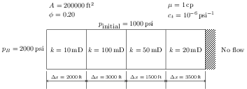

# Homework Assignment 14


## Instructions

If you didn't realize it, the [CMG Tutorial on 1D single-phase flow](https://youtu.be/jt5euIPuB6Y) was also the exact problem we wrote our own Python code for in [Assignment 11](https://github.com/PGE323M-Students/assignment11/blob/master/assignment11.ipynb).  With some easy modifications, we can also solve [Assignment 13](https://github.com/PGE323M-Students/assignment13) in CMG.  Recall the problem schematic



The easiest way to work this problem in CMG is to work through the [tutorial](https://youtu.be/jt5euIPuB6Y) saving your input file as `assignment14.dat`.  Then edit the input file in a text editor and manually change the lines related to grid spacing and permeability.  The permeability line should look something like

```
PERMI  20000 10 100 50 20
```

In this case, 20000 is the largest permeability value allowed in the "fake" grid block without causing an error in CMG.  Edit the line related to grid spacing (keyword: `DI IVAR`) in an appropriate way as well.  Save the input file and run.  Remember to run the simulation for 3 days in 1 day increment time steps.  Once the program has finished running without error, there should be a file `assignment14.out` in the run directory.  Copy this file into this repository, add, commit, and push to Github for submission.

You can use CMG from home via the Cockrell School's Virtual Desktop Environment.  Info on how to connect is available [here](https://wikis.utexas.edu/pages/viewpage.action?pageId=185742118).  There shouldn't be any differences on this problem between CMG 2014 and CMG 2017 (both are installed in the PGE desktop environment), but just to be safe, please use the 2014 version.

## Testing

If you would like to check to see if your solution is correct, run the following commands at the Terminal command line in sequence:

```bash
>python test.py
```
